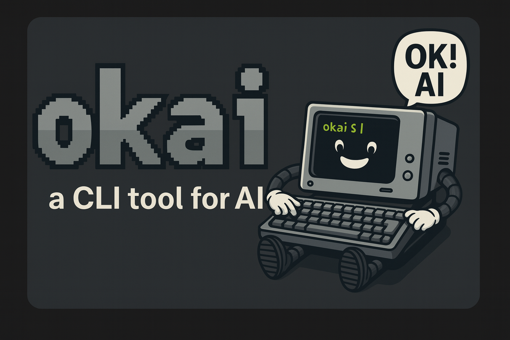

# okai

okai ist ein .NET 10 CLI-Agent für KI-Projekte und kombiniert Chat mit Tool-Calls (Shell, Datei lesen/schreiben, Websuche). Einstellungen kommen aus Umgebungsvariablen oder `okai.config.json`; Themes lassen sich über `OKAI_THEME` wechseln.

## Schnelleinstieg
- Bauen: `dotnet build src/okai/okai.csproj`
- Starten: `dotnet run --project src/okai/okai.csproj`
- Tests: `dotnet test tests/okai.Tests/okai.Tests.csproj`
